# 一、学习笔记
## （一）Linux学习
### 1.文件与目录管理
    Linux 的目录结构为树状结构，最顶级的目录为根目录。其他目录通过挂载可以将它们添加到树中，通过解除挂载可以移除它们。
* #### 绝对路径与相对路径
    绝对路径写法：由根目录 / 写起 。e.g. /usr/share/doc
    相对路径写法：不由 / 写起。e.g.由 /usr/share/doc 要到 /usr/share/man 底下时，可以写成： cd ../man 
* #### 处理目录的常用命令
    * **ls**（英文全拼：list files）: 列出目录及文件名
        &emsp;选项与参数：
        &emsp;&emsp;-a :全部的文件，连同隐藏文件( 开头为 . 的文件) 一起列出来(常用)
        &emsp;&emsp;-d ：仅列出目录本身，而不是列出目录内的文件数据(常用)
        &emsp;&emsp;-l ：长数据串列出，包含文件的属性与权限等等数据；(常用)
    * **cd**（英文全拼：change directory）：切换目录
        &emsp;语法：cd [相对路径或绝对路径]
    * **pwd**（英文全拼：print work directory）：显示目前的目录
        &emsp;选项与参数：-P ：显示出确实的路径，而非使用链接 (link) 路径。
    * **mkdir**（英文全拼：make directory）：创建一个新的目录
        &emsp;语法：mkdir [-mp] 目录名称
        &emsp;选项与参数：
        &emsp;&emsp;-m ：配置文件的权限喔！直接配置，不需要看默认权限 (umask) 的脸色～
        &emsp;&emsp;-p ：帮助你直接将所需要的目录(包含上一级目录)递归创建起来！
    * **rmdir**（英文全拼：remove directory）：删除一个空的目录
        &emsp;语法：rmdir [-p] 目录名称
        &emsp;选项与参数：-p ：从该目录起，一次删除多级空目录
    * **cp**（英文全拼：copy file）: 复制文件或目录
        &emsp;语法:
        &emsp;&emsp;cp [-adfilprsu] 来源档(source) 目标档(destination)
        &emsp;&emsp;cp [options] source1 source2 source3 .... directory
    * **rm**（英文全拼：remove）: 删除文件或目录
        &emsp;语法：rm [-fir] 文件或目录
        &emsp;选项与参数：
        &emsp;&emsp;-f ：就是 force 的意思，忽略不存在的文件，不会出现警告信息；
        &emsp;&emsp;-i ：互动模式，在删除前会询问使用者是否动作
        &emsp;&emsp;-r ：递归删除啊！最常用在目录的删除了！这是非常危险的选项！！！
    * **mv**（英文全拼：move file）: 移动文件与目录，或修改文件与目录的名称
        &emsp;语法：
        &emsp;&emsp;mv [-fiu] source destination
        &emsp;&emsp;mv [options] source1 source2 source3 .... directory
        &emsp;选项与参数：
        &emsp;&emsp;-f ：force 强制的意思，如果目标文件已经存在，不会询问而直接覆盖；
        &emsp;&emsp;-i ：若目标文件 (destination) 已经存在时，就会询问是否覆盖！
        &emsp;&emsp;-u ：若目标文件已经存在，且 source 比较新，才会升级 (update)
* #### Linux 文件内容查看
    * **cat**  由第一行开始显示文件内容
    * **tac**  从最后一行开始显示，可以看出 tac 是 cat 的倒着写！
    * **nl**   显示的时候，顺道输出行号！
    * **more** 一页一页的显示文件内容
    * **less** 与 more 类似，但是比 more 更好的是，他可以往前翻页！
    * **head** 只看头几行
    * **tail** 只看尾巴几行
### 2. vi/vim
    所有的 Unix Like 系统都会内建 vi 文书编辑器，其他的文书编辑器则不一定会存在。
    vim 具有程序编辑的能力，可以主动的以字体颜色辨别语法的正确性，方便程序设计。
* #### 使用
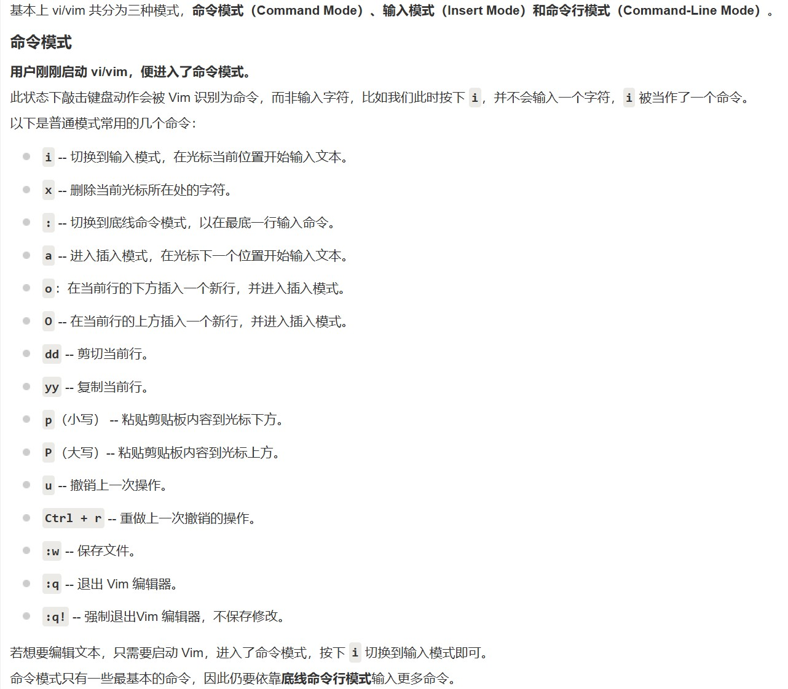
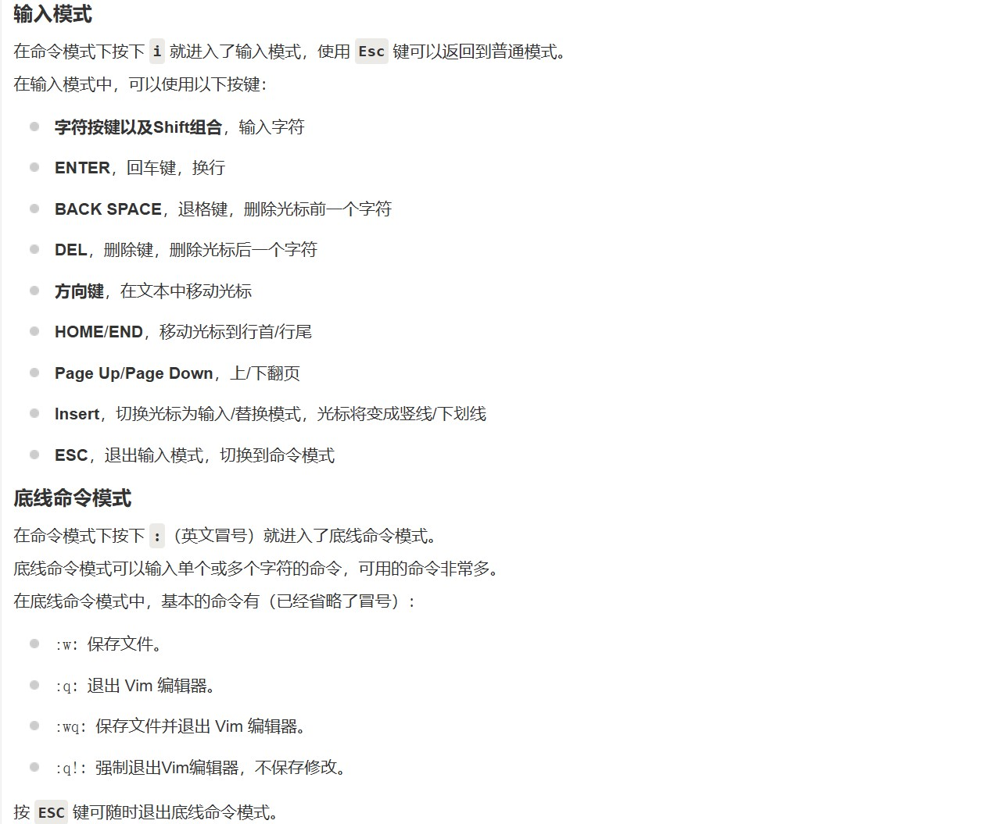
* #### vim 键盘图
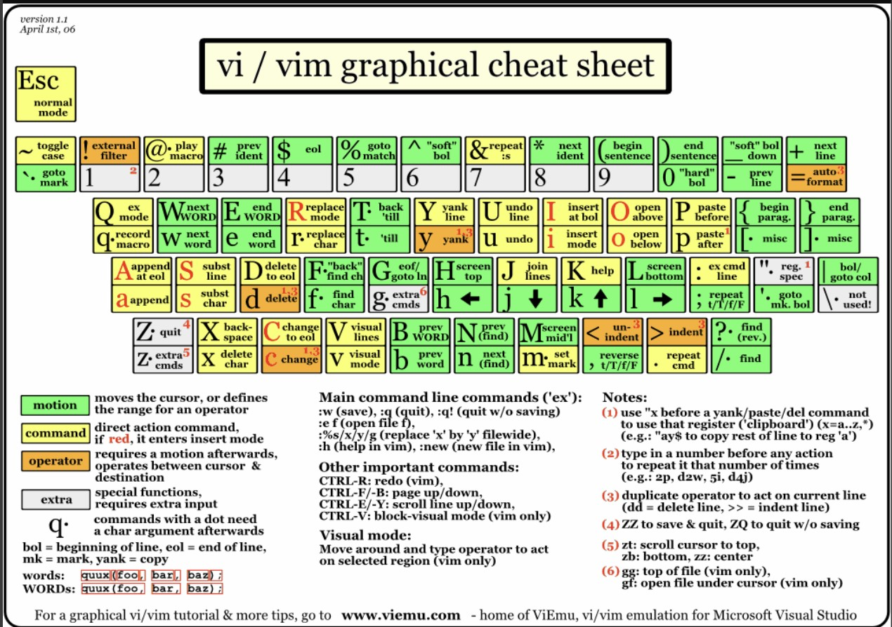
### 3.apt 命令
    apt（Advanced Packaging Tool）是一个在 Debian 和 Ubuntu 中的 Shell 前端软件包管理器。
    apt 命令提供了查找、安装、升级、删除某一个、一组甚至全部软件包的命令，而且命令简洁而又好记。
    apt 命令执行需要超级管理员权限(root)。
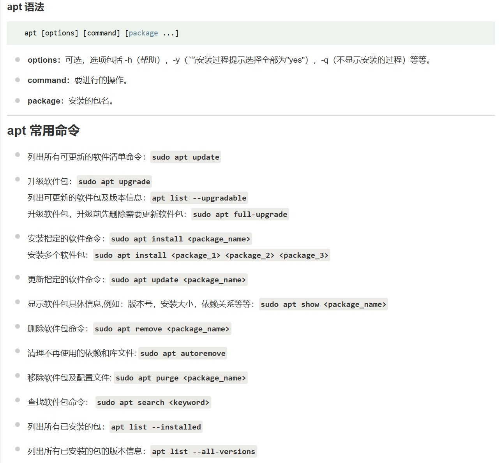

## （二）汇编语言学习
### 1.汇编语言的三类指令
* #### 汇编指令
    **汇编指令是直接被CPU执行的指令，它们在汇编时被转换为对应的机器码。**
    （1）数据传送指令：如MOV，用于在寄存器、内存和I/O端口之间传送数据。
    &emsp;&emsp;&emsp;MOV AX, BX ; 将BX中的数据传送到AX
    （2）算术与逻辑指令：如ADD、SUB，用于进行数学计算和逻辑操作。
    &emsp;&emsp;&emsp;ADD AX, BX ; 将BX中的数据加到AX中
    （3）控制转移指令：如JMP、CALL，用于改变程序执行流程。
    &emsp;&emsp;&emsp;JMP LABEL ; 无条件跳转到LABEL标签
* #### 伪指令
    **伪指令是指导汇编器工作的指令，它们在汇编过程中被处理，但不生成机器码。**
    （1）段定义指令：如SEGMENT、ENDS，用于定义和结束一个段。
    &emsp;&emsp;&emsp;DATA SEGMENT
    （2）数据定义指令：如DB、DW，用于定义字节或字数据。
    &emsp;&emsp;&emsp;DB 0x55 ; 定义一个字节数据0x55
    （3）常量定义指令：如EQU，用于定义常量。
    &emsp;&emsp;&emsp;MAXLEN EQU 255 ; 定义常量MAXLEN为255
* #### 符号指令
    **符号指令用于标识变量、常量、代码段等，在汇编过程中被替换为具体的地址或值。它们没有对应的机器码。**
    （1）标签：用于标识代码中的位置。
    &emsp;&emsp;&emsp;LABEL: ; 定义一个标签LABEL
    （2）宏定义：如MACRO，用于定义宏，简化代码编写。
    &emsp;&emsp;&emsp;MYMACRO MACRO ; 宏定义内容 ENDM
### 2.CPU对存储器的读写
    存储器（Memory）由多个存储单元（Memory Cell）组成，每个存储单元都有唯一的地址（Address），用于存储数据（Data）。
    每个存储单元通常存储一个字节（8位）或一个字（16位）的数据，存储单元按照地址从零开始顺序编号。CPU通过地址访问这些存储单元中的数据。
* #### 总线系统
    &emsp;&emsp;&emsp;地址总线、数据总线、控制总线
* #### 读操作
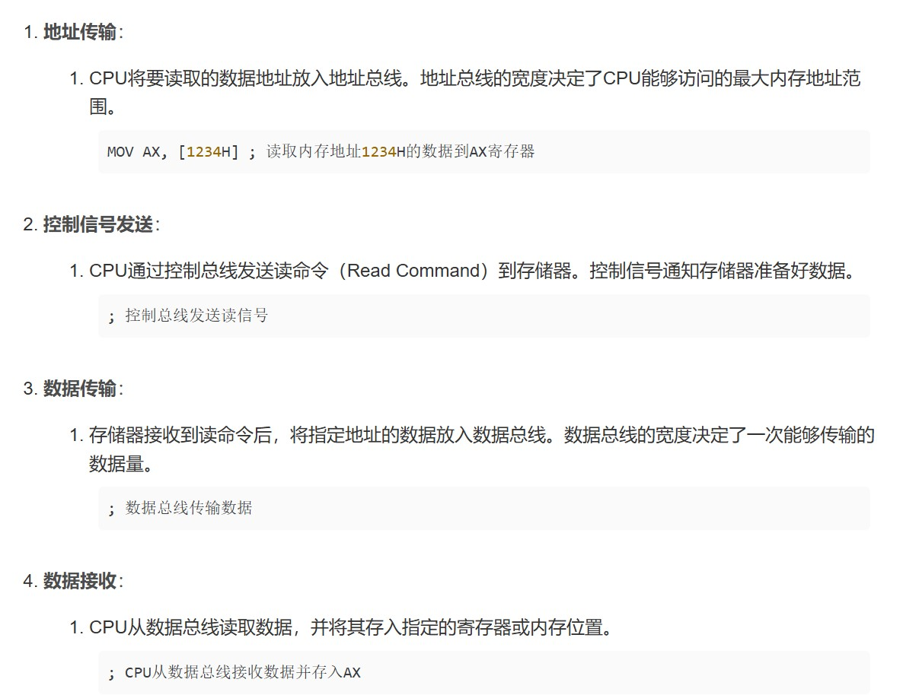
* #### 写操作
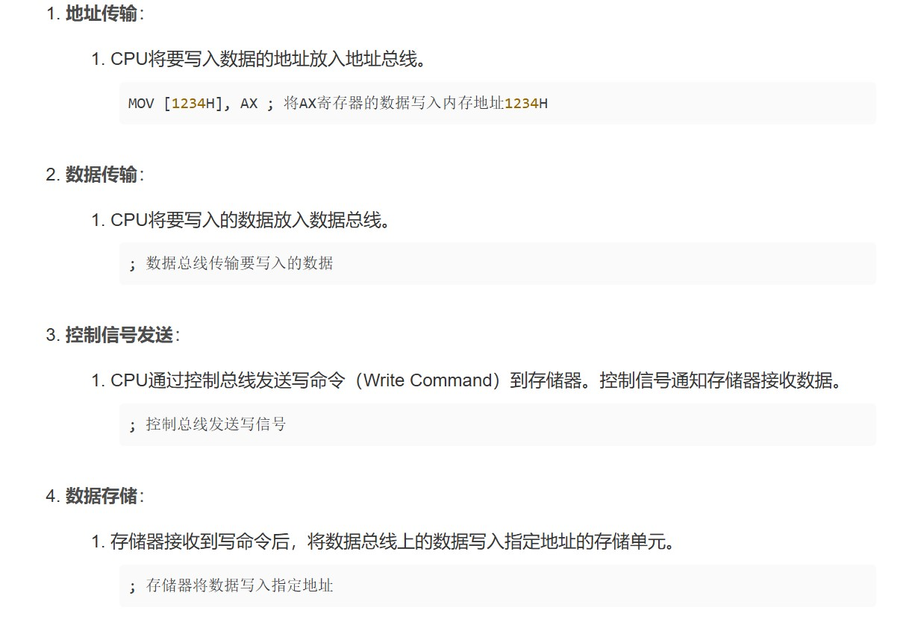
### 3.寄存器
    进行信息存储
* #### 16位结构CPU的特性
    &emsp;&emsp;&emsp;运算器一次最多可以处理16位的数据
    &emsp;&emsp;&emsp;寄存器的最大宽度为16位
    &emsp;&emsp;&emsp;寄存器和运算器之间的通路为16位
* #### 数据处理
    &emsp;&emsp;&emsp;字节 (byte)：8位，可以存在8位寄存器中
    &emsp;&emsp;&emsp;字 (word)：16位，由两个字节组成，可以存在一个16位寄存器中
* #### 物理地址生成
    &emsp;&emsp;&emsp;**物理地址 = 段地址 × 16 + 偏移地址**
* #### 指令执行
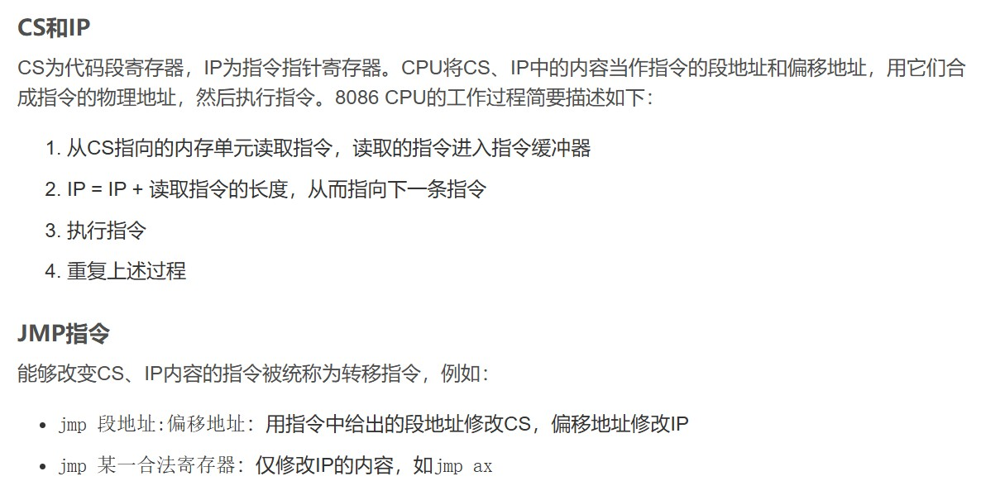
* #### 内存中字的存储
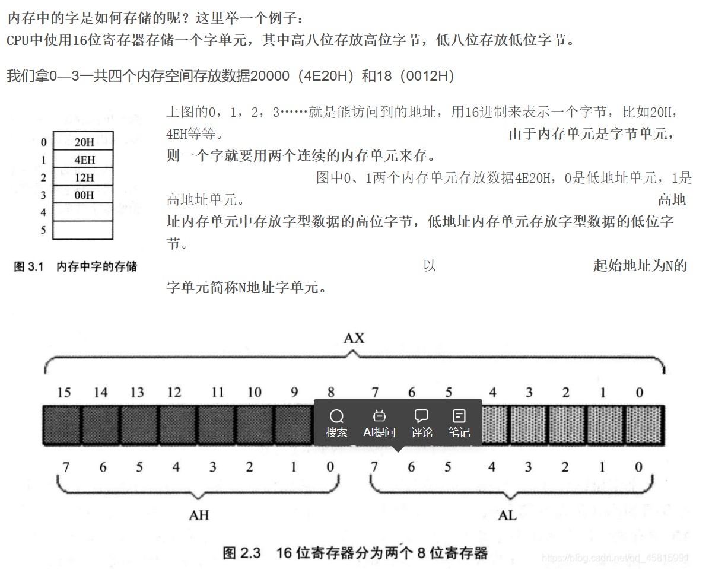
* #### DS和address
    * **DS（数据段寄存器）：**
&emsp;&emsp;&emsp;用于存储数据段的基地址。
&emsp;&emsp;&emsp;数据段用于存放程序的数据（如变量、数组等）。
&emsp;&emsp;&emsp;内存访问指令默认使用DS寄存器来确定数据段的基地址。
    * **CS（代码段寄存器）：**
&emsp;&emsp;&emsp;用于存储代码段的基地址。
&emsp;&emsp;&emsp;代码段用于存放程序的指令（代码）。
&emsp;&emsp;&emsp;CPU在执行指令时使用CS寄存器来确定代码段的基地址
* #### 字的传送
    8086CPU是16位结构，有16根数据线，一次可以传送16位的数据，也就是一个字（word）。
    * 一个字需要两个连续的内存单元来存储。
    * 低位字节存放在低地址单元，高位字节存放在高地址单元。
    * 字单元由两个连续的内存单元组成。例如，地址为N的字单元，N地址存放低位字节，N+1地址存放高位字节。
* #### mov、add、sub指令
    这三个指令都有两个操作对象。
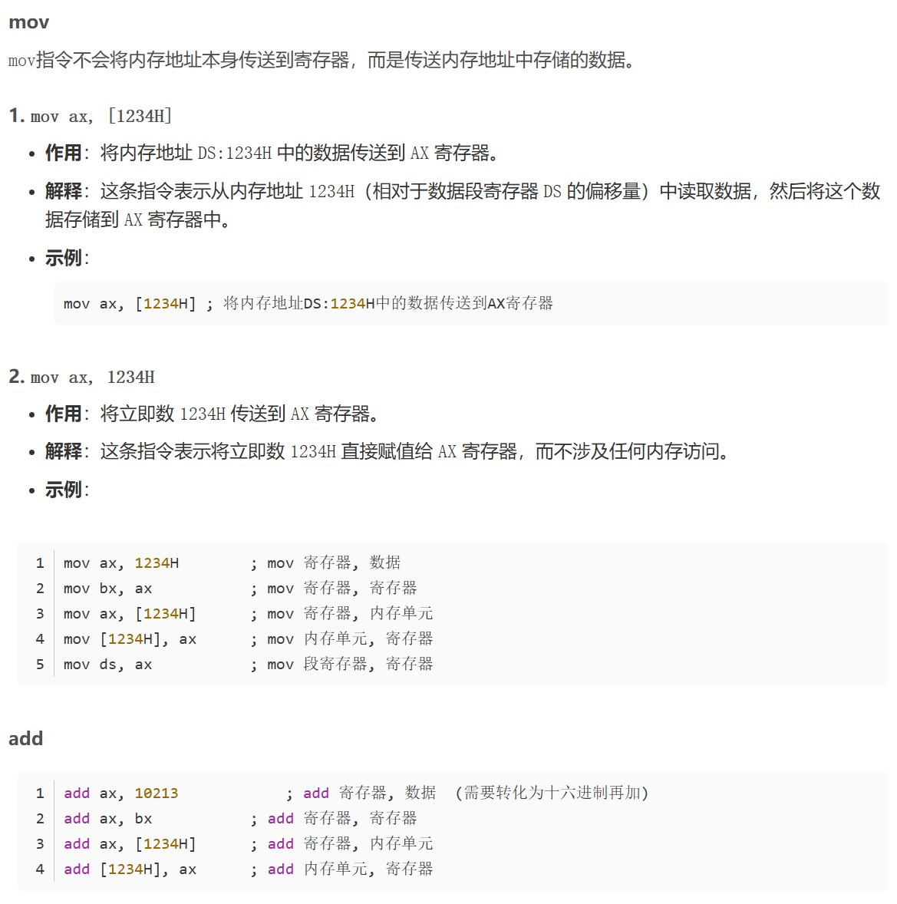
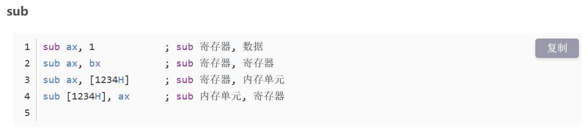
### 4.常见指令
1. MOV：将数据从一个地方移动到另一个地方。
2. ADD：将两个值相加。
3. SUB：从第一个值中减去第二个值。
4. JMP：无条件跳转到一个指定的地址。
5. JZ：如果 Zero flag（零标志）设置为真（true），则跳转到指定的地址。这通常用于检查两个数是否相等。
6. CMP：比较两个值，然后根据比较的结果设置 Zero flag（零标志）。
7. AND：对两个值执行逻辑 AND 操作，并将结果存储在目标操作数中。
8. OR：对两个值执行逻辑 OR 操作，并将结果存储在目标操作数中。
9. NOT：对目标操作数执行逻辑 NOT（非）操作。
10. HLT：挂起程序的执行，直到接收到一个信号或事件。通常用于终止程序或等待外部输入。
11. INC：将目标操作数的值增加1。
12. DEC：将目标操作数的值减少1。
13. MUL：将两个操作数相乘，并将结果存储在目标操作数中。
14. DIV：将一个操作数除以另一个操作数，并将结果存储在目标操作数中。
15. PUSH：将一个值推入堆栈。
16. POP：从堆栈中弹出一个值，并将其存储在目标操作数中。
17. CALL：调用一个子程序，并将返回地址压入堆栈。
18. RET：从堆栈中弹出返回地址，并将控制权转移回调用点。
19. HLT：挂起程序的执行，直到接收到一个信号或事件。通常用于终止程序或等待外部输入。
20. WAIT：等待输入/输出设备的就绪状态。
21. CMP：比较两个操作数，并根据结果设置相关的标志位。
22. JMP：无条件跳转到一个指定的地址。
23. Jcc：根据某个条件是否成立来跳转到指定的地址。这里的 cc 代表各种不同的条件，比如 Z（零标志位）、NZ（非零标志位）、E（相等标志位）、NE（不相等标志位）、B（进位标志位）等。
24. CALL：调用一个子程序，并将返回地址压入堆栈。
25. RET：从堆栈中弹出返回地址，并将控制权转移回调用点。
26. INT：触发一个中断。
27. IRET：返回中断处理程序。
28. CLI：关闭中断。
29. STI：打开中断。。
30. STOS：将一个值存入指定地址的存储单元中。

# 二、解题Wp
## （一）nc连一下（https://www.nssctf.cn/problem/2928）
先去搜了一下Linux中的nc
Netcat（nc）是一个功能强大的网络工具，可以用于读取和写入文件、建立网络连接、进行端口扫描等。
**nc的最基本使用方法：**
    1.打开一个终端并启动nc监听器：nc -lnvp <端口号>
    2.在另一个终端中，输入以下命令以连接到nc监听器：nc <IP地址> <端口号>
    3.在第一个终端中，输入要传输的文本，然后按Ctrl+D或输入exit以结束传输。
题目中给出了端口号，按照格式nc连接，利用ls指令列出文件名，发现有个flag文件，利用cat指令查看，发现是假的
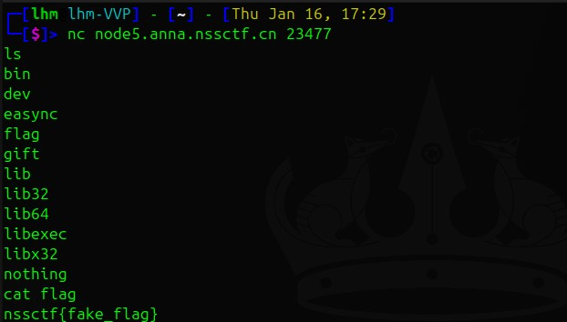
再查看gift，发现是一个文件夹，cd进入，查看各文件找到flag后半段
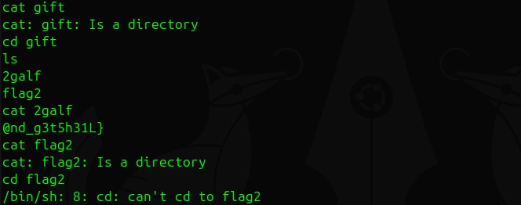
最后查看nothing，这里我犯了一个错误，没有退出gift文件夹就去查看nothing导致出错，最后在nothing文件夹的flag1文件中找到flag的先半段
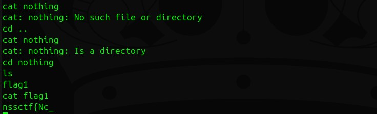
合并一下得到flag为nssctf{Nc_@nd_g3t5h31L}

## （二）test your （https://www.nssctf.cn/problem/4479）
还没有研究成功