# 课后作业

## Ctfhub-RCE模块完成

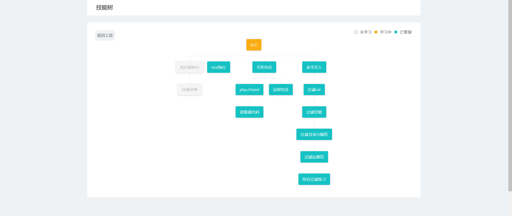

### RCE-labs[1]

看页面代码发现flag,直接写

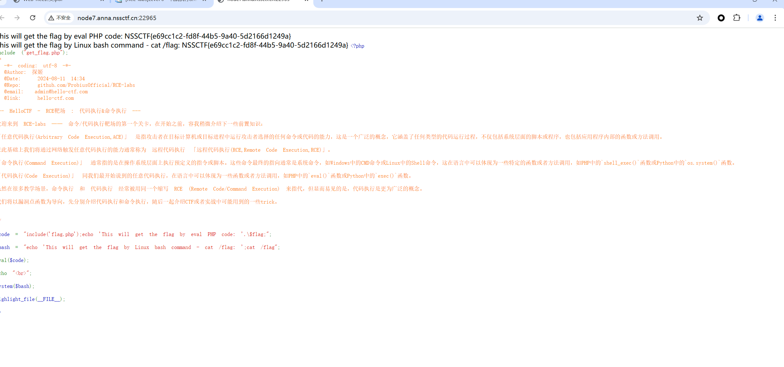

### RCE-labs[2]

分析代码输入a值

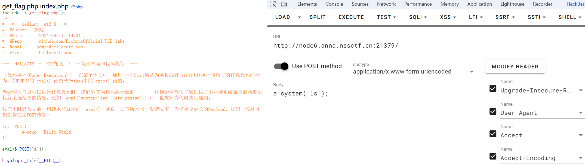

 直接../看文件发现flag直接cat

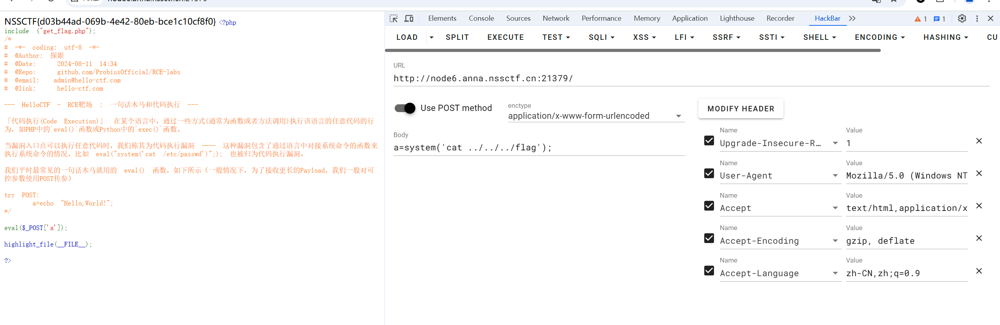

### RCE-labs[3]

分析代码输入action值，获得新函数

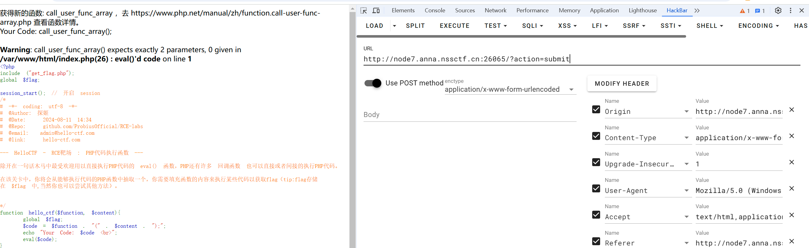

使用新函数传参，得到flag

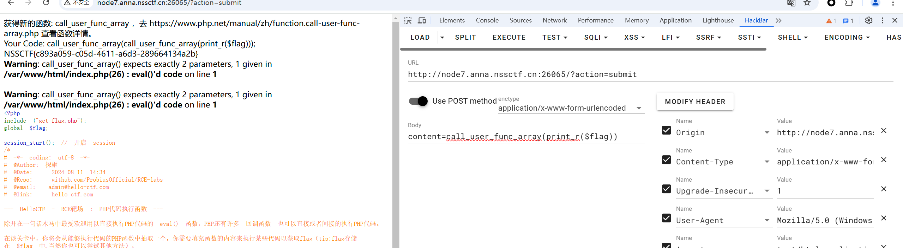

### RCE-labs[4]

分析代码传参，看到flag

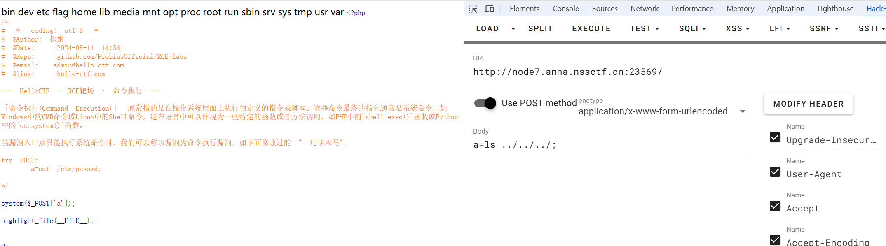

cat看flag

### RCE-labs[5]

看代码直接传ip循环加通道符加指令

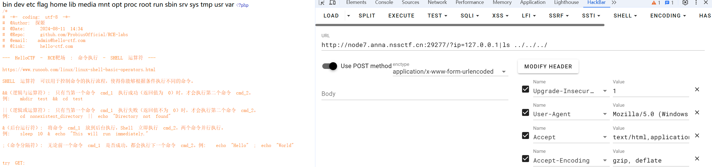

看到flag文件直接cat

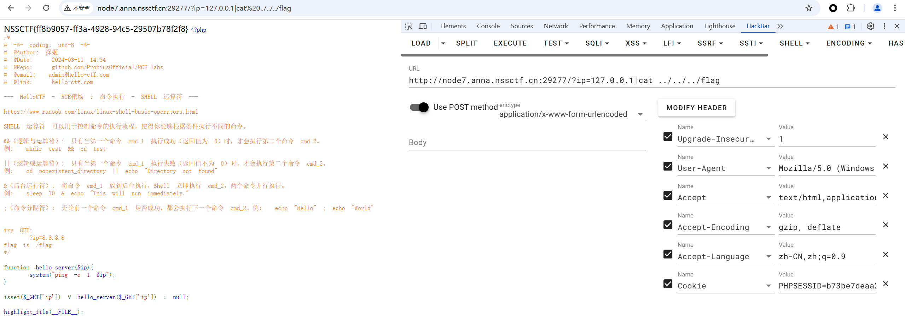

### RCE-labs[5]

分析代码输入cmd值，发现flag

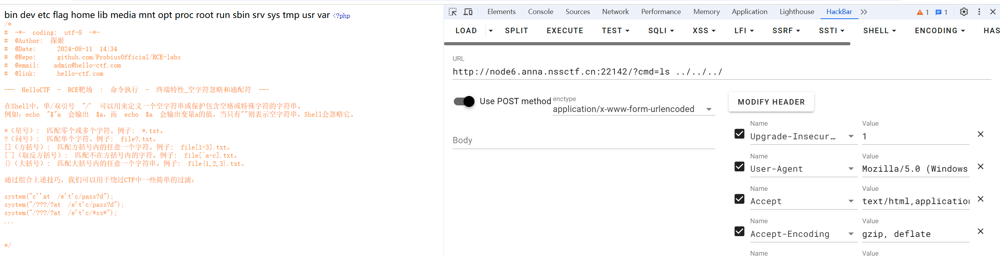

但是flag被过滤直接加‘ ，cat文件得到flag

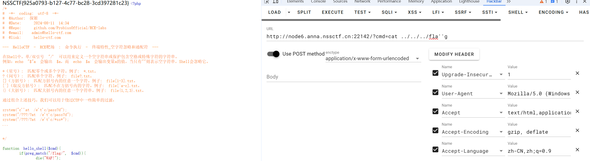

### RCE-labs[6]

分析代码发现大部分被过滤发现开始使用8进制，ls命令发现flag

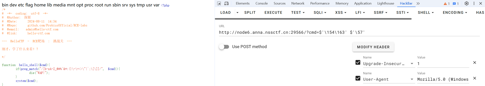

再次8进制cat文件

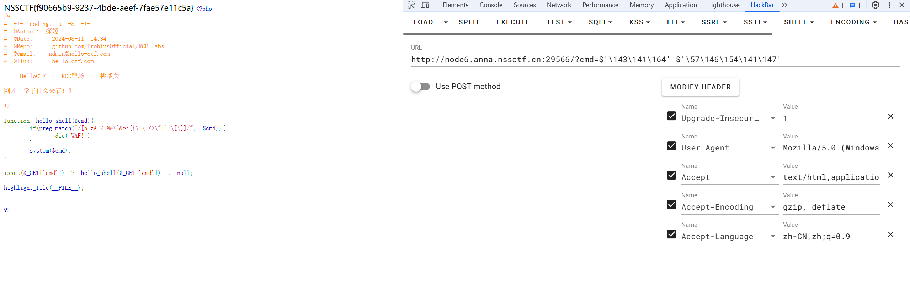

### RCE-labs[7]

分析代码发现空格被过滤使用${IFS}替代输入命令

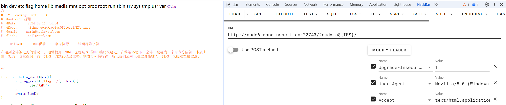

cat flag

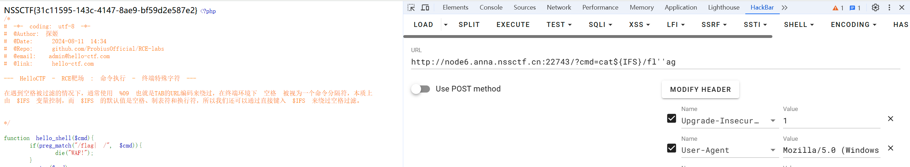

### RCE-labs[8]

重新规定一个朝向，并输出

## linux的搭建和学习

## PHP的学习

