# 课后作业2

### 第一题

分析代码，使file=hint.php

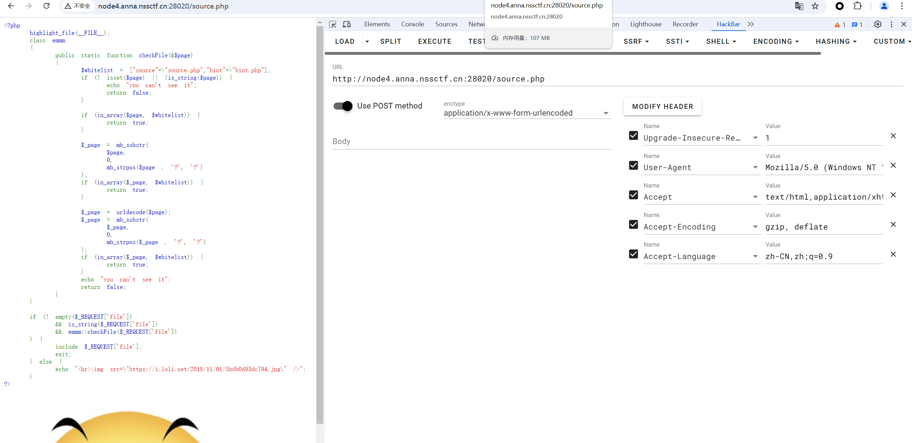

看到flag位置

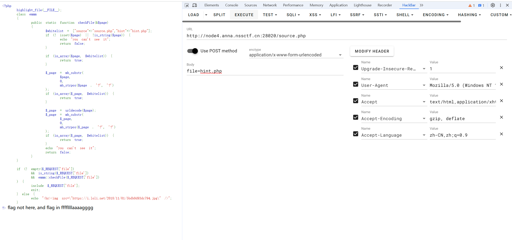

查看文件得到flag

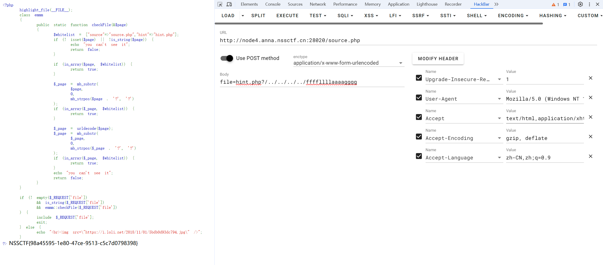

### 第二题

分析代码

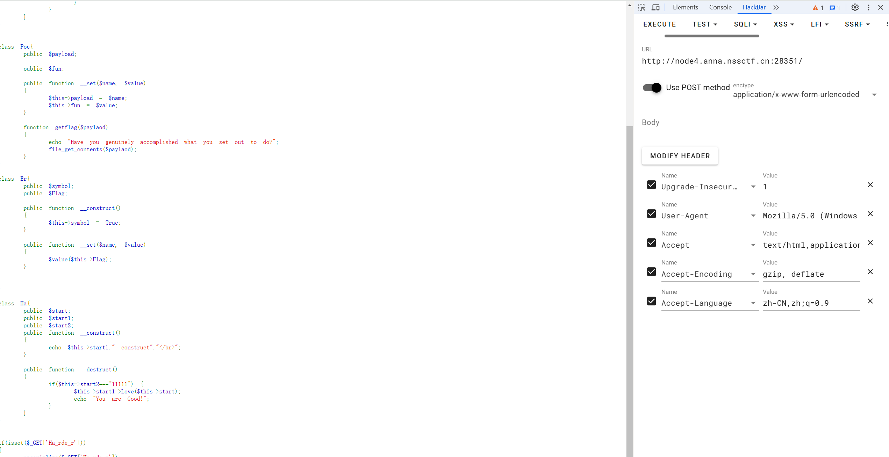

 构造代码得到值

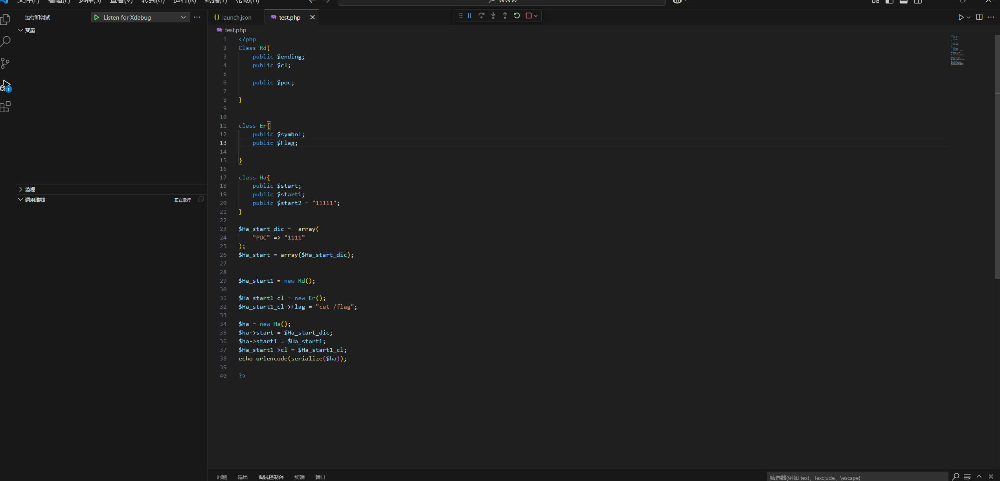

带入值得到flag

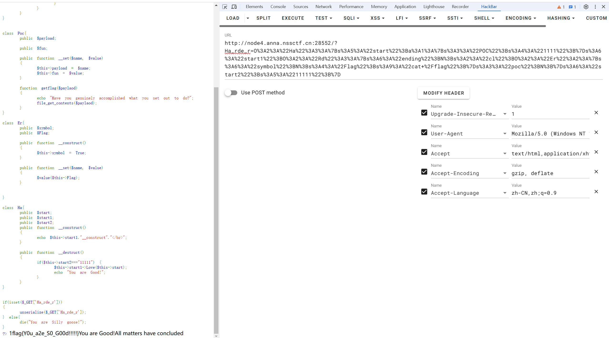

### 第三题

分析代码传参，看到提示查看得到flag位置

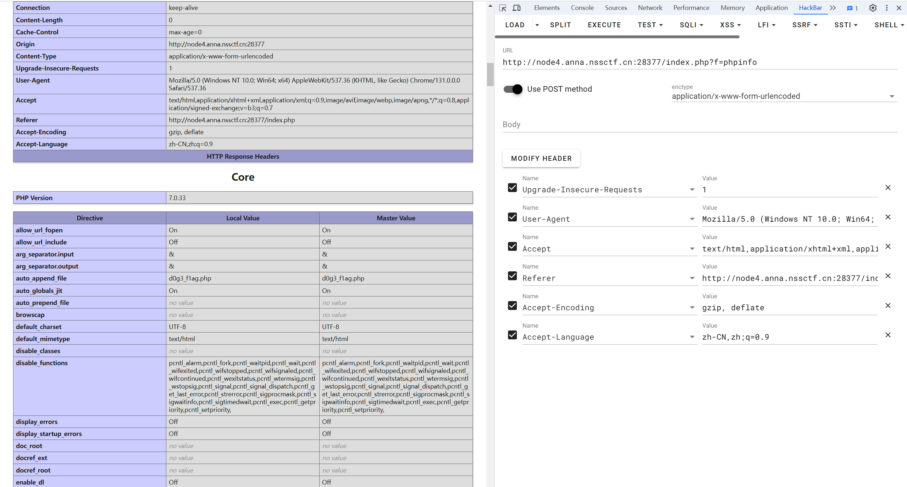

分析代码，构造带入值，其中因为函数PHP等的时候为空 所以吞噬后边的 所以可以构造逃逸

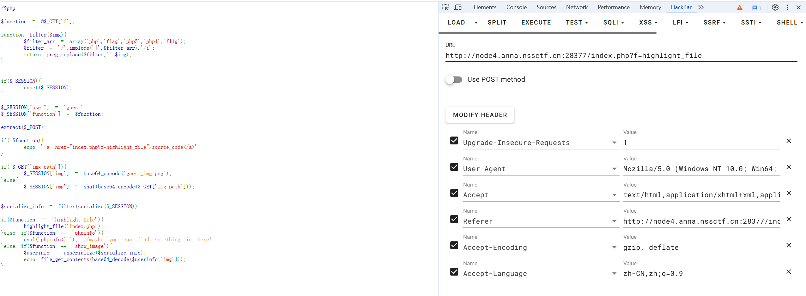

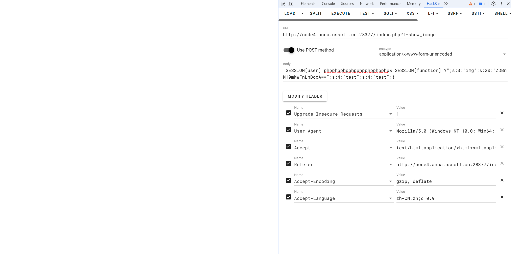

查看源代码看到flag位置

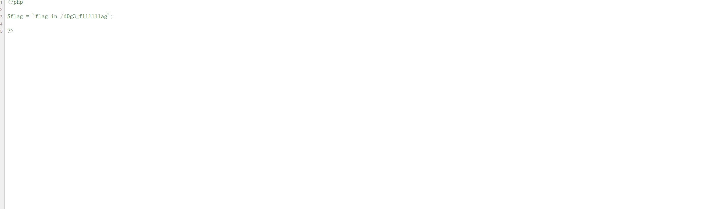

把flag位置文件名64编码并修改逃逸得到flag值

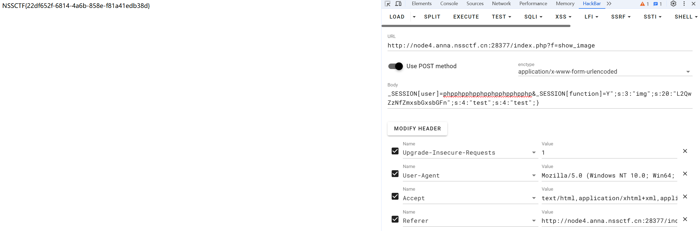

### 第四题

分析代码构造函数

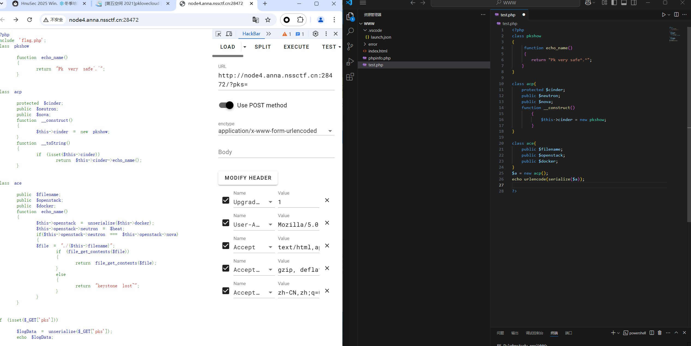

发现可以运行到pkshow函数继续构造

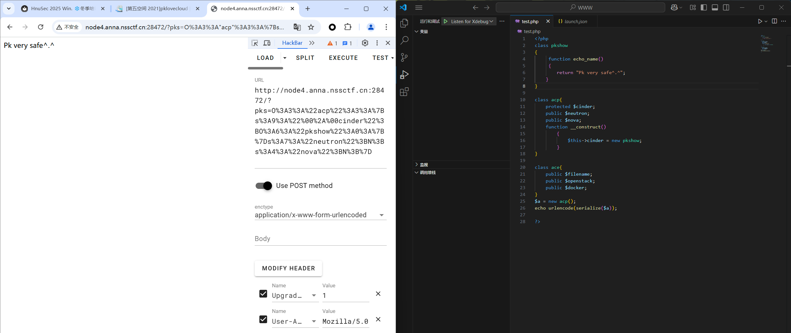

可以运行到ace函数

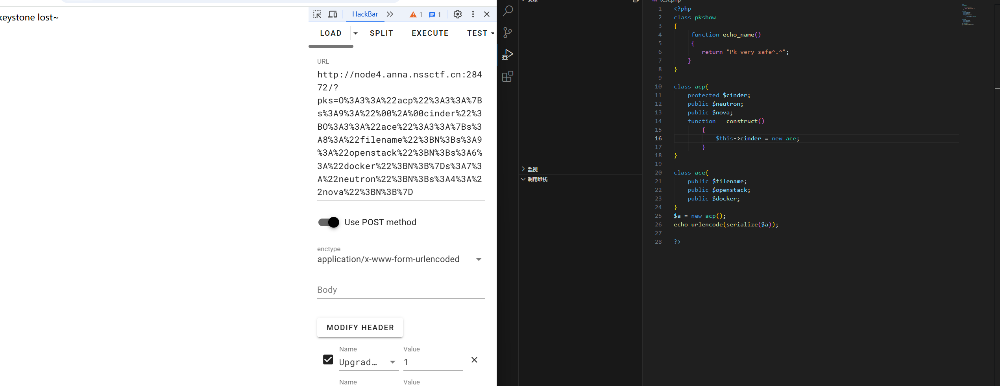

完整构造发现flag位置

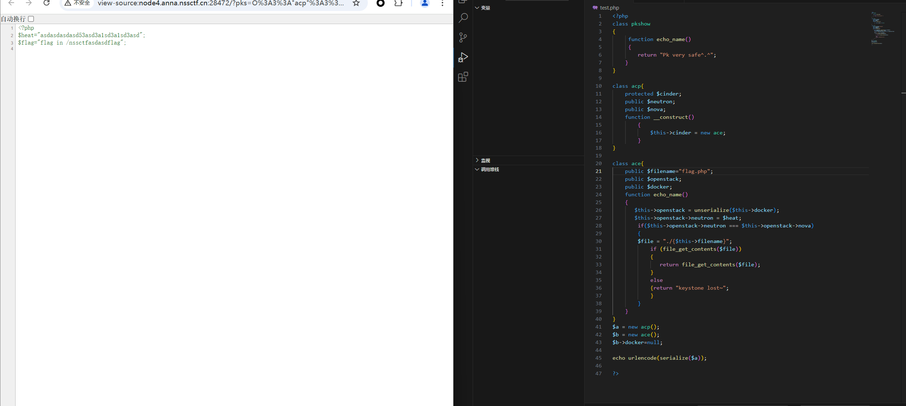

把filename改为flag位置的文件名 输入输出结果得到flag

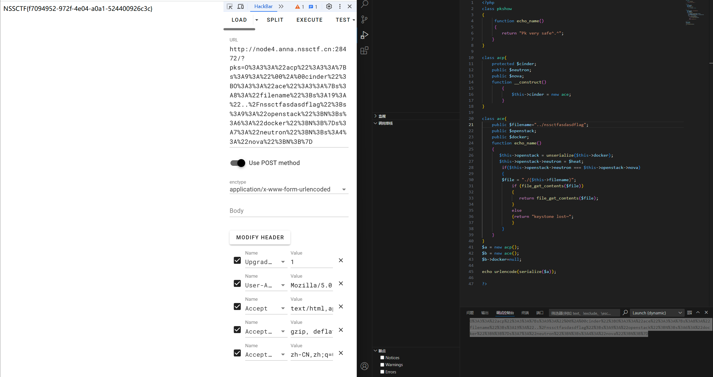

## 做题和学习笔记

