# 作业

## 极客大挑战 2019 BabySQL

随便输入用户名和密码,显示错误

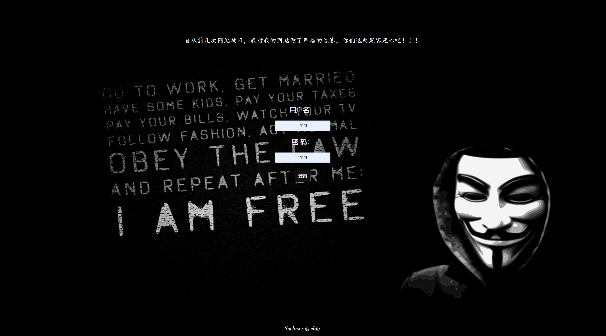

F12，进入HackBar，点load，在密码后加'尝试

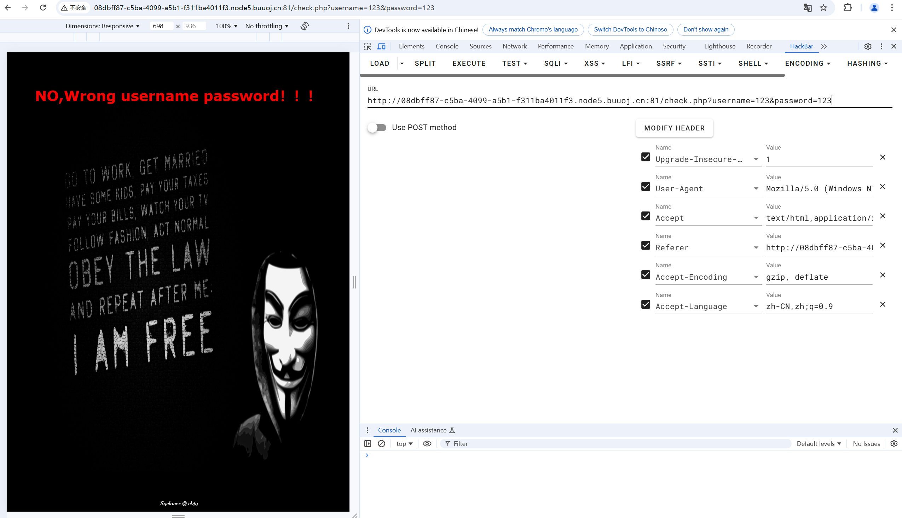

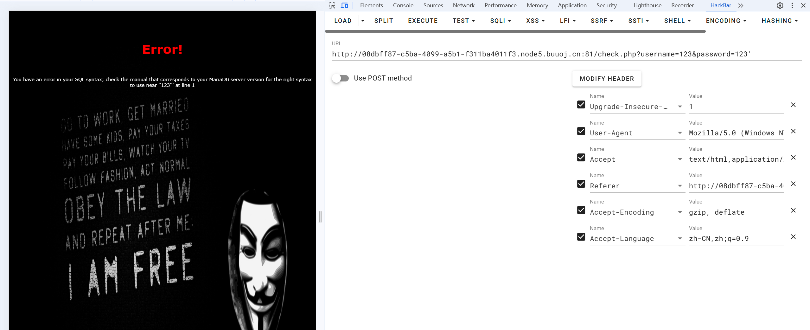

发现错误，所以加注释--+，成功规避

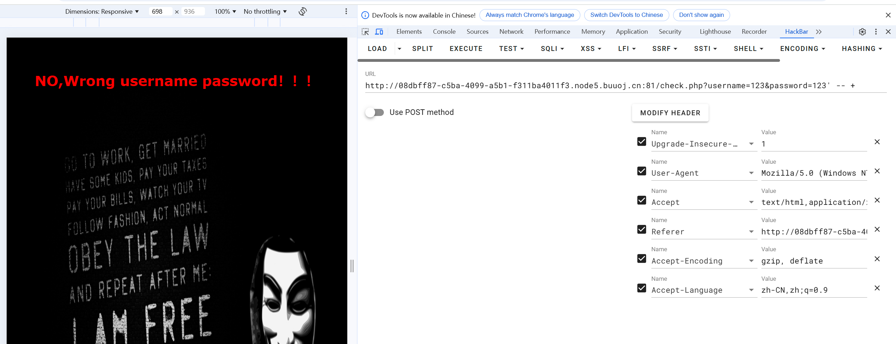

尝试万能密码，发现or被规避

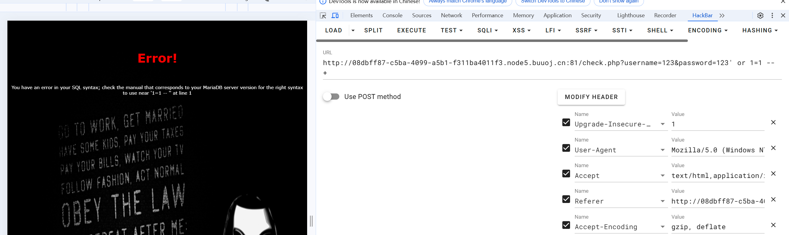

使用双写跳过成功，但答案错误，所以查询完整数据库信息

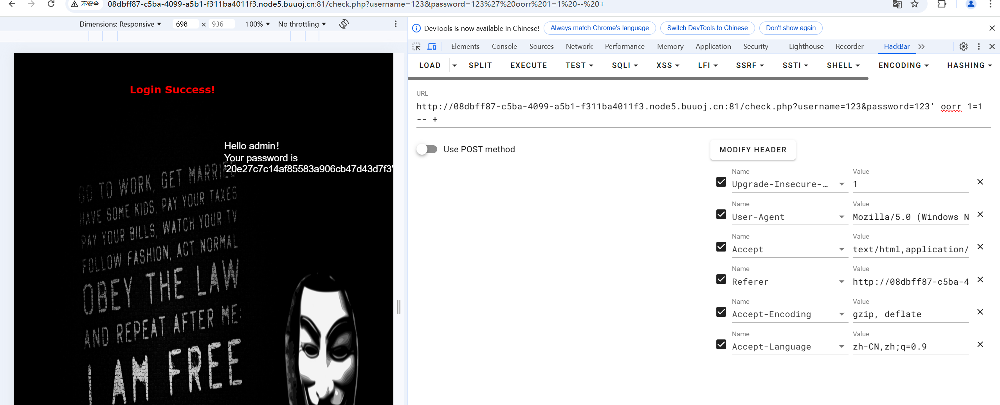

所以order by 3 发现by被删除，再规避，成功

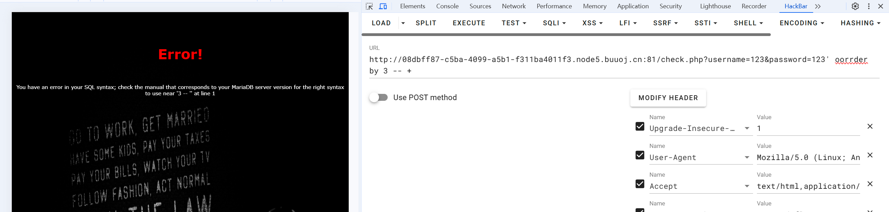

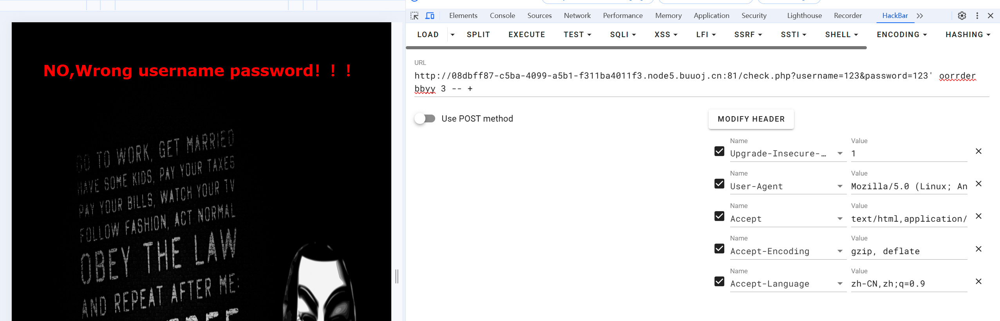

使用union select 发现被删除再规避，成功，显示password=3

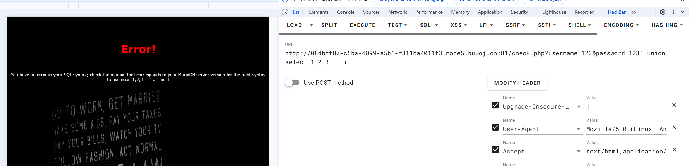

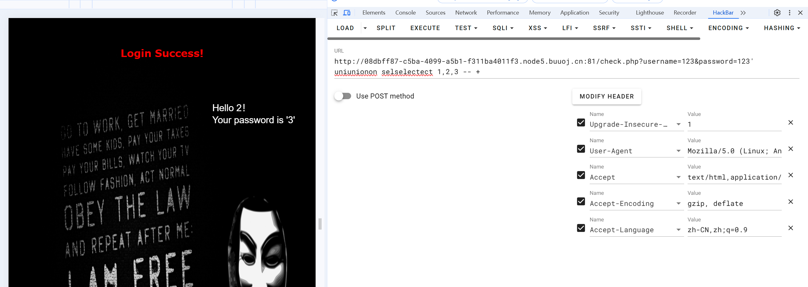

在3位置插入查询语句，发现from，where等被过滤，所以绕过

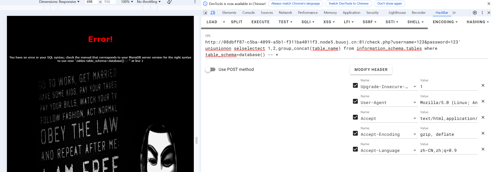

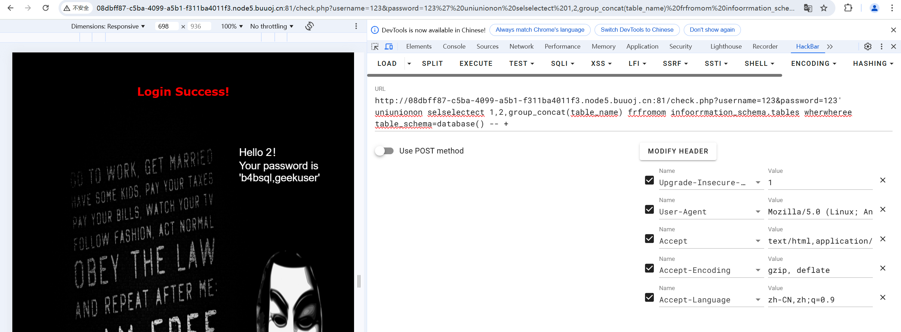

得到数据库名称，查询数据库

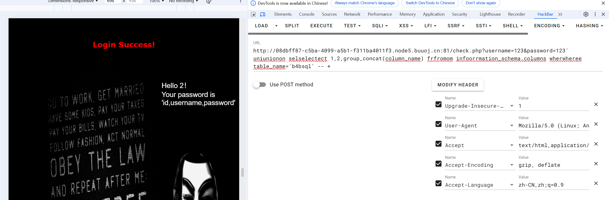

发现password等，先看password，并进行构造查询相应信息

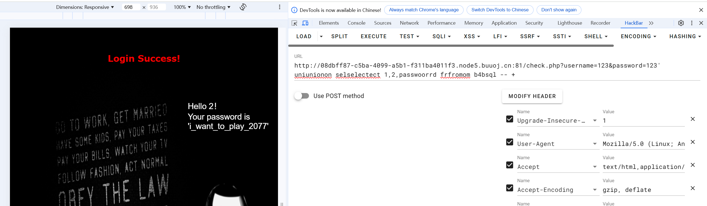

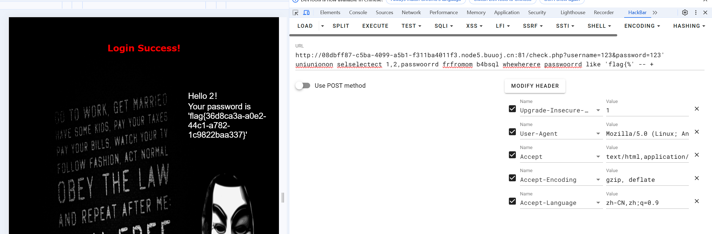

得到flag

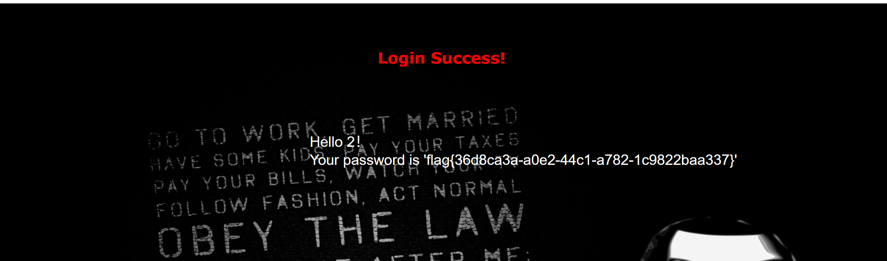
